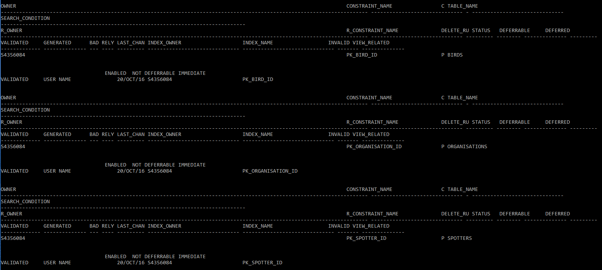
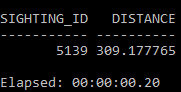

# INFS2200 Assignment
## Roy Portas - 43560846

## Task 1: Constraints

### Part A

```sql
select * from USER_CONSTRAINTS;
```

Output:


\ 

### Part B
```sql
alter table SPOTTERS
add constraint FK_ORG_ID_TO_ORG_ID
foreign key (organisation_id) references ORGANISATIONS (organisation_id);

alter table SIGHTINGS
add constraint PK_SIGHTING_ID
PRIMARY KEY (sighting_id);

alter table SIGHTINGS
add constraint FK_SPOTTER_ID_TO_SPOTTER_ID
foreign key (spotter_id) references SPOTTERS (spotter_id);

alter table SIGHTINGS
add constraint FK_BIRD_ID_TO_BIRD_ID
foreign key (bird_id) references BIRDS (bird_id);

alter table ORGANISATIONS
modify ORGANISATION_NAME 
constraint NN_ORGANISATION_NAME NOT NULL;

alter table SPOTTERS
modify SPOTTER_NAME 
constraint NN_SPOTTER_NAME NOT NULL;

alter table SIGHTINGS
add constraint CK_SIGHTING_DATE
check (SIGHTING_DATE <= TO_DATE('2016-12-31', 'YYYY-MM-DD'));
```

Output:
```

Table altered.


Table altered.


Table altered.


Table altered.


Table altered.


Table altered.


Table altered.

```

## Task 2: Triggers

### Part A
```sql
create sequence SEQ_SIGHTINGS
start with 300000
increment by 1;

create or replace trigger TR_SIGHTING_ID
before insert on "SIGHTINGS"
for each row
begin
	select "SEQ_SIGHTINGS".NEXTVAL into :NEW.sighting_id from DUAL;
end;
/
```

Output: 
```
Sequence created.

Trigger created.

```

### Part B
```sql
create or replace trigger TR_SIGHTING_DESC
before insert on "SIGHTINGS"
for each row
begin
	if :NEW.latitude < -28.4 then
		/* Its less than the middle latitude, thus south */
		if :NEW.longitude < 151.25 then
			/* Its less than the middle longitude */
			select CONCAT(CONCAT('A bird of the species ', BIRD_NAME),
                            ' was spotted in the south-west part of the observation area' )
			into :NEW.DESCRIPTION from DUAL
			inner join BIRDS
			on BIRDS.BIRD_ID = :NEW.BIRD_ID;
		else
			/* Its greater than the middle longitude */
			select CONCAT(CONCAT('A bird of the species ', BIRD_NAME), 
                            ' was spotted in the south-east part of the observation area' )
			into :NEW.DESCRIPTION from DUAL
			inner join BIRDS
			on BIRDS.BIRD_ID = :NEW.BIRD_ID;
		end if;
	else
		/* Its greater than the middle latitude */
		if :NEW.longitude < 151.25 then
			/* Its less than the middle longitude */
			select CONCAT(CONCAT('A bird of the species ', BIRD_NAME), 
                            ' was spotted in the north-west part of the observation area' )
			into :NEW.DESCRIPTION from DUAL
			inner join BIRDS
			on BIRDS.BIRD_ID = :NEW.BIRD_ID;
		else
			/* Its greater than the middle longitude */
			select CONCAT(CONCAT('A bird of the species ', BIRD_NAME), 
                            ' was spotted in the north-east part of the observation area' )
			into :NEW.DESCRIPTION from DUAL
			inner join BIRDS
			on BIRDS.BIRD_ID = :NEW.BIRD_ID;
		end if;
	end if;
	
end;
/
```

Output:
```
Trigger created.
```

### Part C
```sql
INSERT INTO sightings (spotter_id, bird_id, latitude,
longitude, sighting_date)
VALUES (2457, 901, -28.0, 152, '09-MAR-2016');
INSERT INTO sightings (spotter_id, bird_id, latitude,
longitude, sighting_date)
VALUES (1024, 512, -25.6, 153, '09-MAR-2016');
```

Output:
```

1 row created.


1 row created.

```

### Part D
```sql
select * from sightings where sighting_date = '09-MAR-2016';
```

Output:
```
SIGHTING_ID SPOTTER_ID    BIRD_ID   LATITUDE  LONGITUDE SIGHTING_
----------- ---------- ---------- ---------- ---------- ---------
DESCRIPTION
--------------------------------------------------------------------------------------------
     300000       2457        901        -28        152 09/MAR/16
A bird of the species Australian pied cormorant was spotted in the north-east part of the observation area

     300001       1024        512      -25.6        153 09/MAR/16
A bird of the species Mrs. Humes pheasant was spotted in the north-east part of the observation area

```

## Task 3: Views

### Part A
```sql
create or replace view V_ORGANISATION_BIRD_COUNT as select org.ORGANISATION_NAME, count(*) "bird_count"
from ORGANISATIONS org
inner join SPOTTERS sp
	on org.ORGANISATION_ID = sp.ORGANISATION_ID
inner join SIGHTINGS si
	on sp.SPOTTER_ID = si.SPOTTER_ID
group by ORGANISATION_NAME;
```

Output:
```
View created.

```

### Part B
```sql
create materialized view MV_ORGANISATION_BIRD_COUNT as 
select org.ORGANISATION_NAME, count(*) "bird_count"
from ORGANISATIONS org
inner join SPOTTERS sp
	on org.ORGANISATION_ID = sp.ORGANISATION_ID
inner join SIGHTINGS si
	on sp.SPOTTER_ID = si.SPOTTER_ID
group by ORGANISATION_NAME;

```

Output:
```

Materialized view created.

```

### Part C
```sql
SELECT * FROM V_ORGANISATION_BIRD_COUNT;
```


\ 

```sql
SELECT * FROM MV_ORGANISATION_BIRD_COUNT;
```


\ 

The materialized view is much faster because the data is stored in a table, instead of having to be queried through the other tables.

## Task 4: Function Based Indexes

### Part A

```sql
select * from (
    select SIGHTING_ID, sqrt(power((LATITUDE + -28), 2) + power((LONGITUDE + 151), 2))
    as DISTANCE 
    from SIGHTINGS
    order by DISTANCE desc
) where ROWNUM <= 1;
```


\ 

### Part B

```sql
create index IDX_HEADQUARTERS_DISTANCE on 
SIGHTINGS(sqrt(power((LATITUDE + -28), 2) + power((LONGITUDE + 151), 2)));
```

### Part C

```sql
select * from (
    select SIGHTING_ID, sqrt(power((LATITUDE + -28), 2) + power((LONGITUDE + 151), 2))
    as DISTANCE 
    from SIGHTINGS
    order by DISTANCE desc
) where ROWNUM <= 1;
```


\ 

The index will be indexing the queries, so when the database goes to calculate the distance, it will first look up
the equation in the index, and return the precomputed value if found.

We don't get massive performance boosts because a lot of the distances are unique. However if there was 
many duplicates, such as birds at the exact same position, there would be more noticable improvements.

## Task 5: Execution Plan and Analysis

### Part A

```sql
explain plan for select SIGHTING_ID, SPOTTER_NAME, SIGHTING_DATE 
from SIGHTINGS 
inner join SPOTTERS
	on SPOTTERS.SPOTTER_ID = SIGHTINGS.SPOTTER_ID
where SIGHTINGS.SPOTTER_ID = 1255;

SELECT PLAN_TABLE_OUTPUT FROM TABLE (DBMS_XPLAN.DISPLAY);
```


\ 

The query plan can be described as a series of steps:

1. Run a index scan on the `SPOTTER_ID` in the `SPOTTERS` table to evaluate the where clause
2. Rows are located by the `ROWID` index in the `SPOTTERS` table and the the entire `SIGHTINGS` table is read
3. The `SPOTTERS` table becomes the outer loop and the `SIGHTINGS` table becomes the inner loop, it then joins the tables with a nested loop
4. Apply the select statement on the result

### Part B

```sql
alter table SIGHTINGS
drop constraint FK_SPOTTER_ID_TO_SPOTTER_ID;

alter table SPOTTERS
drop constraint PK_SPOTTER_ID;

explain plan for select SIGHTING_ID, SPOTTER_NAME, SIGHTING_DATE 
from SIGHTINGS 
inner join SPOTTERS
	on SPOTTERS.SPOTTER_ID = SIGHTINGS.SPOTTER_ID
where SIGHTINGS.SPOTTER_ID = 1255;

SELECT PLAN_TABLE_OUTPUT FROM TABLE (DBMS_XPLAN.DISPLAY);
```

### Part C

Tree Height: 2

Leaf Blocks: 9

Block accesses needed for a direct full scan of the BIRDS table:

= `Number of leaf blocks + Number of branch blocks`
= `9 + 1`
= `10`
